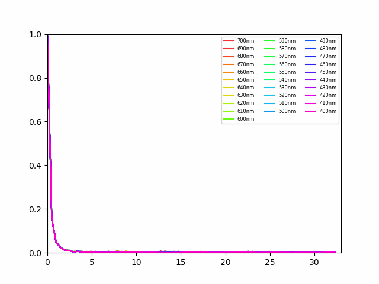

# DeepOptics by PyTorch

基于 PyTorch 的衍射快照高光谱成像研究代码：联合优化衍射光学元件（DOE）与 Res-UNet 重建网络，从模拟 RGB 测量重建 400–700 nm、间隔 10 nm 的 31 波段光谱图像。

> 当前 DOE 的 `_quantized_path` 保留原代码的连续高度优化，离散取整被注释掉。虽然存在量化级数参数，这不是已经实现并验证的量化感知训练。此次整理没有更改这一算法行为。

## 项目结构

```text
deepoptics/
  config.py              # 光学系统、DOE 和网络默认参数
  constants.py           # 波长、材料折射率和传感器响应
  train.py               # 训练 CLI、优化器和实验输出
  evaluate.py            # 验证集 PSNR
  losses.py / metrics.py # 损失与指标
  optics/                # 相机、DOE、传播与传感器模型
  models/                # Res-UNet
  data/                  # ICVL MAT 读取与裁剪
  utils/                 # 原有 SSIM 实现
tests/                   # 数据、计算和入口回归测试
docs/                    # 迁移说明与示例图
datasets/                # 本地数据，不上传数据文件
runs/                    # 本地实验输出，不纳入版本管理
main.py / trainer.py     # 根目录启动入口
```

## 安装

使用 Python 3.10 或更高版本。先按本机 CUDA 环境安装匹配的 PyTorch / torchvision，再在仓库根目录执行：

```bash
python -m pip install -e .
```

开发测试依赖：`python -m pip install -e ".[dev]"`。依赖声明是最低版本范围，不是经过穷举验证的兼容性矩阵。

## 数据准备

```text
datasets/ICVL/
  train/*.mat
  validation/*.mat
```

读取 HDF5 格式的 MAT 文件，字段 `rad` 的形状为 `(31, H, W)`；转换为 `(H, W, 31)` 的 float32，并除以 4095。图像至少为 512×512；原始增强策略针对 1392×1300 图像，生成一张缩放图和九张 512×512 裁剪图。请自行划分训练集和验证集，避免同一原图跨集合。普通非 HDF5 MAT 文件不受此读取器支持。

## 训练

在仓库根目录运行：

```bash
python -m deepoptics --help
python -m deepoptics --data-root datasets/ICVL --epochs 30 --batch-size 4 --device cuda
```

也可以使用 `python main.py`、`python trainer.py` 或安装后的 `deepoptics-train`。默认 `--device auto` 选择可用的 CUDA，否则使用 CPU。默认 512×512 图像、1024×1024 波前及七层网络的计算和显存需求较高；可先减小 batch size。CPU 支持不代表完整训练速度可接受。

每次运行创建独立的 `runs/<时间戳>/`，保存 `config.json`（启动参数）、TensorBoard 事件、`MTF/`、`PSF/` 和 `checkpoints/epoch-XXX.pt`。光学和网络参数在 `deepoptics/config.py` 修改。权重文件为 `model.state_dict()`，不包含优化器状态，不是完整的断点续训文件。

```bash
tensorboard --logdir runs
```

验证接口为 `deepoptics.evaluate.psnr_eval`，保留原有“按 batch 计算 PSNR 后平均”的定义。验证时会临时进入 `eval()`，结束后恢复模型原模式。DOE 高度噪声仍沿用原实现，因此验证结果可能有随机波动。

## 验证和迁移

```bash
python -m pytest -q
```

测试使用合成数据和缩小的光学/网络配置，检查导入无副作用、MAT 读取、评估模式以及 CPU/CUDA 前向反向计算。它们不能替代真实 ICVL 数据的完整训练或论文指标复现。

旧模块位置与兼容性变化见 [迁移说明](docs/MIGRATION.md)。

## MTF 示例

以下为已有实验的 MTF 动图可视化。


